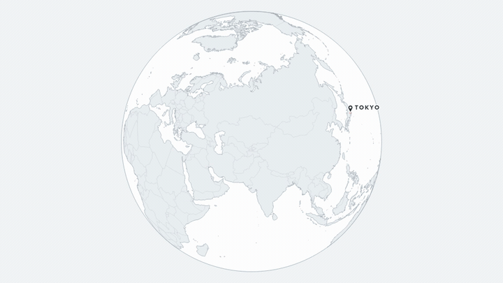
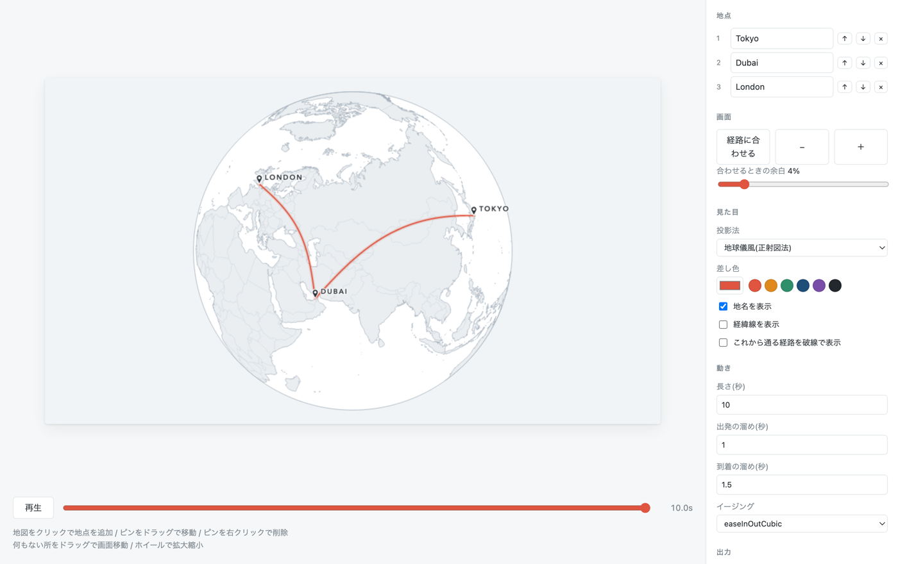
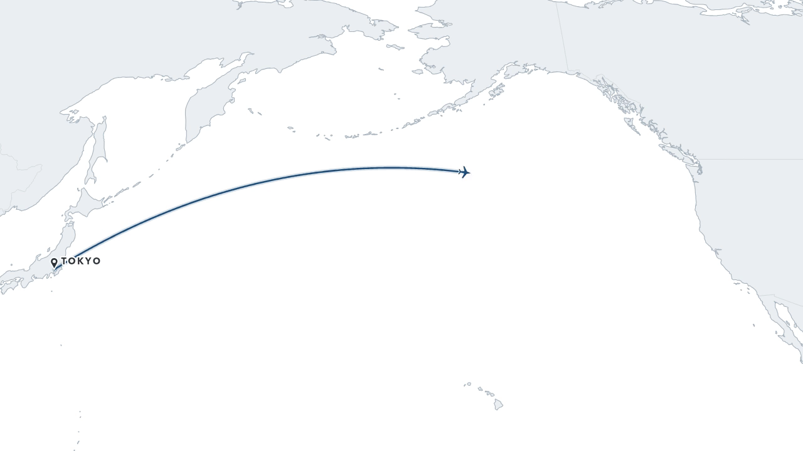

# Map Route Anim

旅行動画向けに、飛行機の経路が地図上を伸びていくアニメーションを作ってMP4に書き出すツール。

出発地・経由地・到着地を地図上に置くだけで、地点間を大円で結んだ経路が描かれていく動画ができます。



## ブラウザで使う(インストール不要)

**https://myne0915.github.io/map-route-anim/**

開くだけで使えます。書き出しまでブラウザ内で完結するので、インストールもアカウント登録も要りません。作ったデータがどこかへ送られることもありません。

> 書き出しには WebCodecs を使います。Chrome / Edge / Safari 16.4以降で動作します。



## 特徴

- **インストール不要。** ブラウザだけで書き出しまで完結します
- **地図データは数MB。** Natural Earth(パブリックドメイン)を使うので、地図タイルのダウンロードもAPIキーも不要
- **外部API依存ゼロ。** ネットワークにデータを送りません
- **プレビューと書き出しが同じコード。** 見えているものがそのまま書き出されます
- **書き出しが速い。** ハードウェア符号化を使います
- 帰属表示の焼き込み不要(Natural Earthはパブリックドメイン)

## 使い方

### 地点を置く

| 操作 | 動作 |
|---|---|
| 地図をクリック | 地点を追加 |
| ピンをドラッグ | 地点を移動 |
| ピンを右クリック | 地点を削除 |

右のパネルで名前の編集・並べ替え・削除もできます。

### 画面を動かす

| 操作 | 動作 |
|---|---|
| 何もない所をドラッグ | 画面移動(地球儀のときは回転) |
| ホイール | カーソル位置を中心に拡大縮小 |
| 「経路に合わせる」 | 経路全体が収まるように合わせ直す |

**画面は勝手に動きません。** 地点を足しても視点は保たれるので、今見えている範囲の外にもピンを置けます。合わせ直したいときだけボタンを押してください。

### 書き出す

- **MP4を書き出す** … アニメーション全体を動画にします
- **この位置をPNGで保存** … 再生ヘッドが指しているコマを静止画にします

どちらも出力解像度(最大4K)で書き出されます。

### 調整できるもの

| 分類 | 項目 |
|---|---|
| 見た目 | 投影法(地球儀風 / 自然地球 / 正距円筒 / メルカトル)、差し色、地名・経緯線・破線の表示 |
| 動き | 長さ、出発と到着の溜め、イージング |
| 出力 | 解像度(1080p / 4K / 縦 / 正方形)、fps(24 / 30 / 60) |

プロジェクトはJSONで保存・読込できます。視点も保存されるので、開き直しても同じ画から再開できます。

## 出力例



## ローカルで動かす場合

自分で改造したいときや、コマンドラインから一括で書き出したいときに使います。

| | バージョン | 備考 |
|---|---|---|
| Node.js | 20.19以上 または 22.12以上 | Viteの要件 |
| ffmpeg | コマンドライン書き出しのみ必要 | `brew install ffmpeg` |

```bash
git clone https://github.com/MYne0915/map-route-anim.git
cd map-route-anim
npm install
npm run dev     # http://localhost:5180
```

### コマンドライン

GUIの「保存」で書き出したJSONを使います。ffmpegが必要です。

```bash
# 保存したプロジェクトから書き出す
npm run render -- path/to/route.json -o out/my-route.mp4

# 投影法や配色の比較用に静止画を一括出力する
npm run still
```

## 仕組み

### レンダラは1つだけ

プレビューも書き出しも**同じ `drawFrame` を呼びます**。違うのは解像度だけです。

```
                src/core/draw.js  ←  唯一のレンダラ
        ┌───────────────┼───────────────┐
   プレビュー      ブラウザ書き出し      CLI書き出し
  (canvas)      WebCodecs → MP4    Node → ffmpeg → MP4
```

描画ロジックをどれか1つに書くと、そこから出力がズレ始めます。`src/core/` にはCanvas 2D以外のAPIを持ち込まない方針です。

### 地図はキャッシュする

地図(陸・国境・海岸線)は再生中に変化しないので、オフスクリーンに一度だけ描いて毎フレーム貼り付けます。これがフレームコストの約95%を占めるため、この一手で書き出しが12倍速くなります(1080p・300フレームで29.5秒 → 2.4秒)。

### 視点は解像度に依存しない形で持つ

倍率を「短辺に対する比率」、位置を「キャンバスサイズに対する比率」で保持しています。そのためプレビュー(960px)で調整した見え方が、書き出し(1920px以上)でも完全に一致します。

### 弧は画面空間で持ち上げる

経路は大円(最短経路)ですが、正射図法では視点の中心を通るため画面上で直線に退化します。そこで投影後の画面空間で法線方向に持ち上げています。地理的な経路は正しいまま、見た目にだけ弧を与えられます。

### 書き出しにffmpeg.wasmを使わない理由

ブラウザ側は WebCodecs の `VideoEncoder` でH.264に符号化し、`mp4-muxer` でMP4に詰めています。

ffmpeg.wasm はコアだけで64MBある上に、マルチスレッド版は `SharedArrayBuffer`(=COOP/COEPヘッダ)を要求します。**GitHub Pages はそのヘッダを設定できません。** WebCodecs ならハードウェア符号化が使え、追加の依存も muxer 数十KBで済みます。

## ファイル構成

```
src/core/     レンダラ本体(ブラウザ・Node共用、Canvas 2Dのみ)
  draw.js     描画
  geo.js      投影法・視点・フィット計算
  arc.js      大円の計算
  timeline.js 時刻 → 進捗
  style.js    配色と書体のプリセット
  project.js  データモデルと入力の検証
src/node/     Node専用(フォント登録)
web/          GUI(Vite + 素のJavaScript)
  main.js     UIと操作
  export.js   ブラウザ内でのMP4 / PNG書き出し
scripts/      CLI(書き出し・静止画)
```

## 書体について

地名ラベルにはmacOS同梱の書体(Avenir Next など)を使っています。フォントファイルはこのリポジトリに含まれていません。実行環境にインストールされているものを名前で参照します。

**macOS以外でも動作します。** 該当する書体が無い環境では既定のサンセリフに置き換わり、ラベルの見た目が変わるだけで機能は損なわれません。

## 制限

- **飛行機の経路のみ。** 車・鉄道の市街地ルートには対応していません(その縮尺の地図データを持たないため)
- 出力は不透過MP4のみ。アルファ付き出力は未対応

## データの出典

地図データは [Natural Earth](https://www.naturalearthdata.com/)([world-atlas](https://github.com/topojson/world-atlas) 経由)。パブリックドメインです。

## ライセンス

MIT License. 詳細は [LICENSE](./LICENSE) を参照してください。
